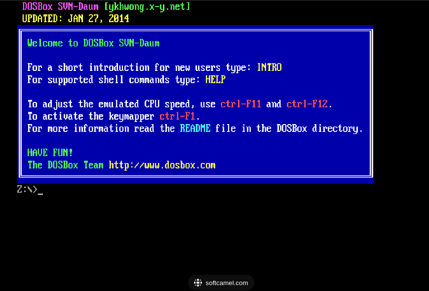
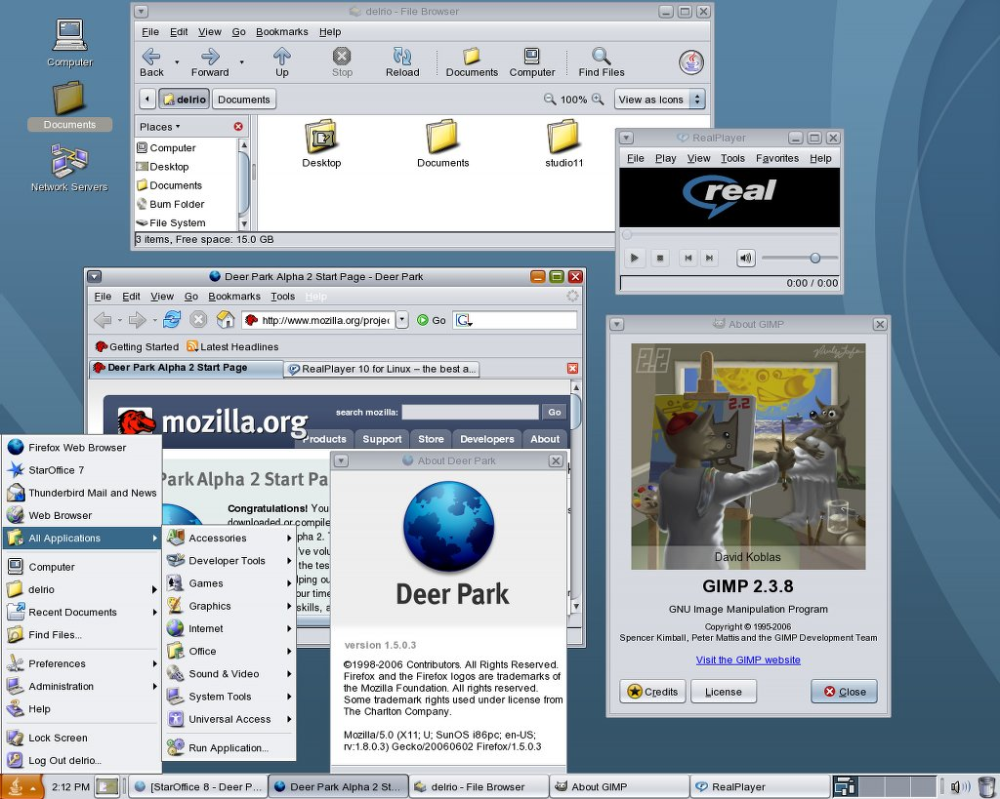
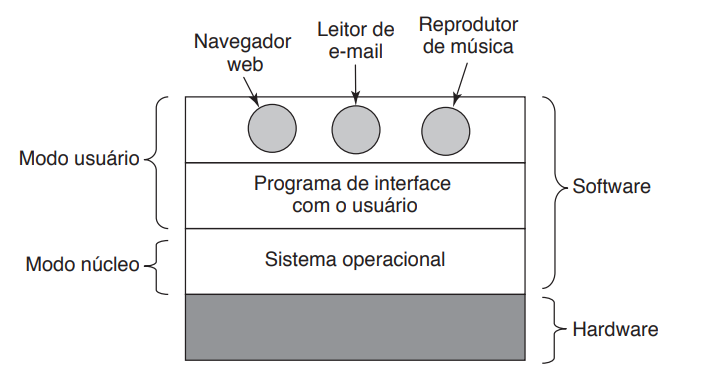
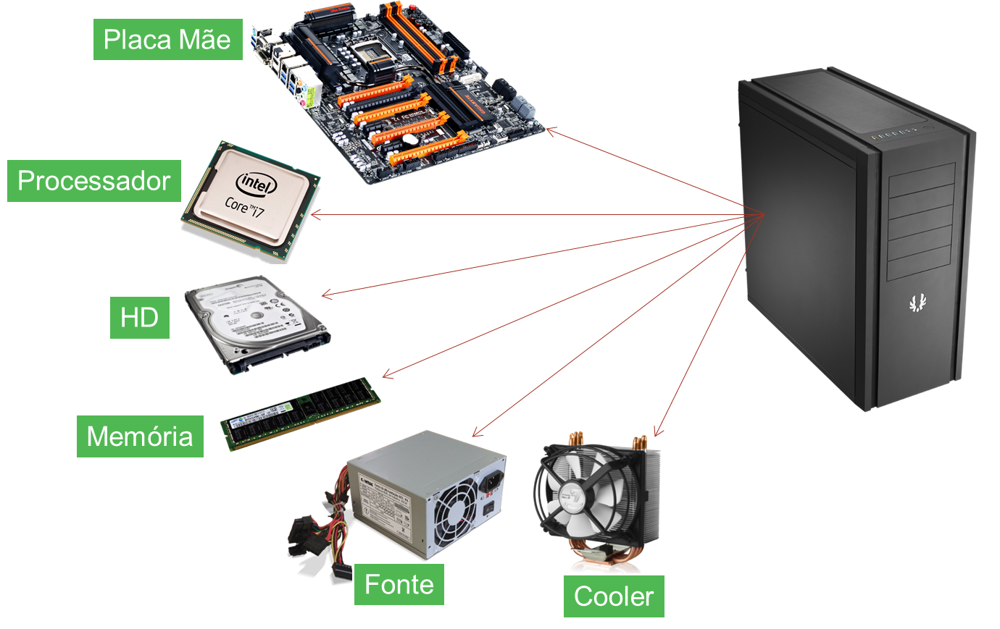
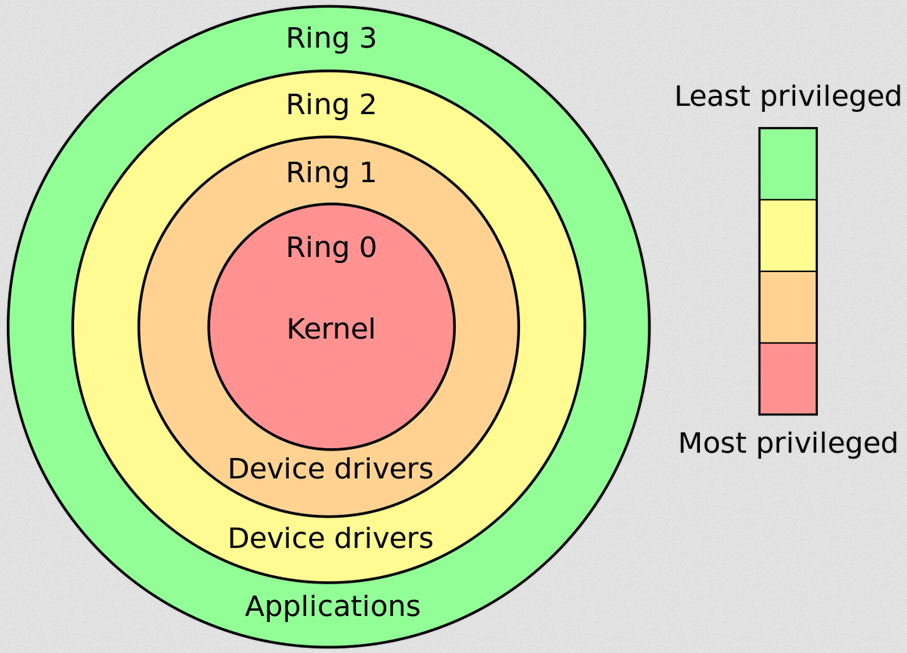

# Linux e sistemas operacionais - O Conceito

&nbsp;

### Conteúdo do artigo

- [No início, apenas um rodava](#no-inicio-apenas-um-rodava)
  - [O começo do multiprocesso](#o-começo-do-multiprocesso)
  - [O básico sobre hardware](#O-básico-sobre-hardware)
- [O linux, como kernel de código aberto e as ferramentas GNU](#O-linux-como-kernel-de-código-aberto-e-as-ferramentas-GNU)
  - [O que consiste uma distribuição linux?](#O-que-consiste-uma-distribuição-linux?)
  - [Distro escolhida, mãos a obra!!](#Distro-escolhida-mãos-a-obra!!)
- [Conclusão](#conclusão)

&nbsp;

## No inicio apenas um rodava

É complicado começar a descrever os sistemas operacionais sem antes falar dos computadores, no começo, tivemos todo tipo de arquitetura, até chegarmos nos computadores de hoje em dia, os dados eram gravados em fitas magnéticas, ate hoje são utilizadas em soluções de backup para armazenamento de dados duradouro ( aqueles que se espera durarem mais ).

Para contextualizar, um dos primeiros sistemas operacionais para computadores pessoais ( famosos pcs ) era o DOS, na qual a microsoft mais tarde viria a lançar o MSDOS. Ambos eram sistemas monotarefa, ou seja, Voce só poderia acessar um programa de cada vez, a memória era completamente ocupada por aquele programa, e a cpu só se preocupava em processar aquilo. Imagina, hoje em dia, você só podendo escolher usar o navegador ou a planilha, para fazer um calculo era preciso fechar a planilha e abrir a calculadora.

"Se quiser testar um programa, você pode baixar o dosbox e tentar rodar no seu computador uma emulação do [DOS](https://sourceforge.net/projects/dosbox/)"

&nbsp;

### O começo do multiprocesso

Rapidamente, a demanda de termos processos em paralelo no mundo doméstico foi surgindo, e com isso, os sistemas operacionais foram obrigados a adotar uma outra abordagem, foi ai que nasce o unix, o primeiro sistema multitarefa e multiprocessos, o sistema que permitia rodar multiplos programas em paralelo.

" a lógica é simples, ao invés de ligar o pc e rodar um programa só, é melhor colocar como programa primário um programa que chama outros programas, aqui também começa um dos conceitos da computação que são os grafos, ou árvores "

Certo, dito isso surge o minix, um sistema operacional criado pelo professor Tanenbaum para ensinar sobre sistemas operacionais para seus alunos. Boa parte do minix foi tirado como clone do unix, e isso gerou a inspiração para Linus Torvalds criar o seu próprio sistema operacional, que mais tarde seria chamado de linux. Embora não seja bem isso, já chegando para desmentir e tirar alguns conceitos enraizados, explicarei a diferença entre kernel e binários de userspace, ou userland.

&nbsp;
### O básico sobre hardware

Um sistema operacional é um software, um componente que interage com as peças ( HD, MEMÓRIA, CPU, USB, TECLADO, MOUSE e etc) para permitir que por meio de suas características, calculos binários sejam realizados para transformação de dados em outros dados, tudo em computação é realização de um de-para alguma coisa, e podemos dividir esse sistema em 3 niveis.

" hardware, kernel e userland (modo usuário),o controlador ou intermediário que controla a usabilidade das peças e o espaço do usuário, onde efetivamente rodam os programas, este é o kernel "

A stack de hardware é dividida em 5 peças, sendo estes recursos essenciais para o funcionamento dos computadores. O primeiro e mais essencial é a cpu, precisamente a unidade dentro do computador, responsável por realizar os calculos de todo sistema através de instruções ( comandos ), estas instruções possuem lógicas e algoritmo para determinadas finalidades ( calculo de ponto flutuante, virtualização e calculos mais genericos ). A memória, é o local onde as informações utilizadas pelo computador são alocadas, essa memória geralmente é chamada de RAM ( Random Acess Memory ) e tem a característica de ser volátil ( nao persiste informações). Para conectar estes dois elemento utilizamos uma placa mãe, onde seus compotente fazem toda gestão de entrada e saida (i/o), este conceito abarca todo fluxo de  informações que entra e sai, que vai de algum lugar para outro,  para realizar a conexão de seus componentes utilizamos sockets compativeis, tanto para o processador(exemplo AM4 para processadores AMD) quanto para a memória (DDR4, tipo de memória compativel com o socket AM4 , e por consequência, por sua família de processadores). Devemos ficar atentos aos HDS/SSDS, respectivamente Hard Disk e Solid State Disk, é esta classe de dispositivos que guarda suas informações, também chamado de "memória persistente", é comum a confusão entre RAM e armazenamento persistente, mas a diferença é que um apaga seus dados quando o computador é desligado, ou outro não.

" Uma separação entre disco, memória, cpu e armazenamento "

Já o kernel pode ser demonstrado em ação com sua utilização  em camadas,  chamadas de rings, literalmente anéis onde quanto mais perto do centro, mais privilégios o software possui, e mais perto do hardware ele está.

&nbsp;
## O linux, como kernel de código aberto e as ferramentas GNU

Você pode pensar que a diferença entre os programas que rodam no espaço do kernel e do userland é basicamente quem faz a gestão do seu software, se faz a gestão de hardware, é contato direto com o kernel, se faz uso de funções de alto nível como um print na tela, está mais para userland, de qualquer forma, tudo passa pelo intermediário, pela kernel  palavra essa que significa "núcleo", sendo literalmente o coração do sistema operacional, a essa parte em específico chamamos de kernel. No dia a dia dos usuários de linux, quase nunca precisamos interagir diretsmente com o kernel, salvo para ativar um módulo ou alterar algum parâmetro, mas 98% das vezes iremos estar utilizando ferramentas de userspace, geralmente ferramentas como bash, cd, cp, mv, ls, sed e awk, todas estas ferramentas são programas que interagem com o kernel para realizar alterações no sistema, veremos melhor a separação entre user space e kernel na parte de boot deste livro.

Estas ferramentas chamamos de ferramentario GNU, e este conjunto normalmente chamamos de GNU/linux, uma junção do kernel linux com ferramentas GNU, isso é o suficiente para termos um sistema operacional, mas pode ser que tu nao tenha ouvido falar sobre quando comentam sobre linux, provavelmente as palavras mais ouvidas por você são "debian",  "ubuntu", "red hat" , "arch linux" e outros

&nbsp;
### O que consiste uma distribuição linux?

3 são os critérios para separar as distribuições linux em suas principais finalidades, são eles:

- Gerenciador de pacotes
- mantenedores
- programas pré instalados

Estes critérios dizem respeito sobre a finalidade de cada programa, bem como a forma de cada distribuições ser identificada, temos distribuições que sao derivadas de outras distribuições, como exemplo o ubuntu que é uma derivação do debian, ou o fedora, que é uma derivação do red hat, qual a diferença entre eles? Bem, o Ubuntu foca em ser uma distribuição de desktop, assim como o fedora, e seus "pais" são distribuições mais genéricas e agnosticas, qualquer debian ou redhat pode virar um ubuntu ou fedora, basta instalar os mesmos programas, falaremos mais sobre pacotes na parte de virtualização e gerenciamento de programas.

Para os fins práticos das nossas atividades, irei fazer um exercício na qual utilizando o docker ( ferramenta para gerenciar e criar imagens para containers ) eu crio uma distribuição que pode ser utilizada em qualquer computador, escolhi o debian por ser mais portátil, e é com ele que seguirei este curso.

&nbsp;
### Distro escolhida, mãos a obra!!

Este tutorial consiste nos seguintes passos:

- baixar e instalar o docker
- baixar uma imagem e extrair o conteúdo da imagem, este será nossa parte de userland
- criar um disco raw de 25 gb, será o disco utilizado para nossa maquina virtual
- criar as partições, formatar com sistema de arquivo ext4 e montar
- descompactar o conteúdo do docker la dentro
- making a chroot
- instalar dependencias e fazer configurações( kernel, grub, fstab)
- Ligar a maquina virtual

&nbsp;
## Conclusão

### Referências

[Sistema operativo, wikipedia](https://pt.m.wikipedia.org/wiki/Sistema_operativo)
[Unix, wikipedia](https://pt.wikipedia.org/wiki/Unix)