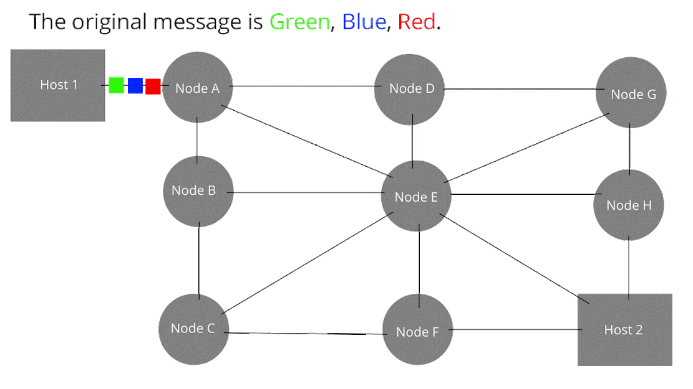

# Redes e conexão - O Conceito

&nbsp;

### Conteúdo do artigo

- [O começo da era da telecomunicação](#o-começo-da-era-da-telecomunicacao)
  - [As coneções de rede](#as-coneçoes-de-rede)
  - [Os tipos de rede ( Topologia )](#os-tipos-de-rede)
- [Um laboratório para testes de rede](#um-laboratorio-para-testes-de-rede)
- [Conclusão](#conclusão)

&nbsp;

## O começo da era da telecomunicação
Tudo começou na década de 60, quando tudo que tinhamos em nossas casas eram telefones fixos, ou seja, cabos telefonicos que trafegavam voz através de impulsos elétricos, esse tipo de comunicação funcionava a partir da tecnologia de comutação de cirtuito, ou seja, uma ligação direta e constante de energia, de uma ponta a outra, a grande sacada foi a criação da comutação de pacotes, na qual os dados eram particionados em "pacotes" de informação e entregues, isso permitia uma economia na banda e uma possibilidade de controle maior dos envios.

"Um diagrama exemplo da comutação de pacotes"

&nbsp;
### As coneções de rede
Antes de adentrar as informações mais profundas sobre o funcionamento da rede em si, precisamos deixar algumas explicações mais técnicas sobre como são definidos os padrões de redes, porque naturalmente, como aprendemos com sistemas operacionais, padrões são utilizados para sabermos o propósito e o design de alguma solução, é o exemplo do posix para sistemas operacionais, no caso de redes utilizamos as [RFCs](https://www.rfc-editor.org/search/rfc_search_detail.php?sortkey=Number&sorting=DESC&page=All&pubstatus%5B%5D=Standards%20Track&std_trk=Internet%20Standard), e por sua vez, as redes são normalizadas pela [IEEE 802](https://ieee802.org/secmail/pdfocSP2xXA6d.pdf), São padrões mais técnicos do que o POSIX e costumam ser mais utilizados no geral.

As redes, conceitualmente, são classificadas em suas disposições, e o interessante é fazer com que redes distintas possam se comunicar. As classificações mais utilizadas de redes são:

- Lan (Local Area Network)
Rede local, é a rede da nossa casa ou da nossa empresa, pode ser simples, com apenas um roteador (gateway) ou complexa, com multiplos roteadores e switchs com várias camadas de abstração. 

- Wan (Wide área Network)
O exemplo mais simples é a internet, um conjunto de redes Lan, esse amontoado todo chamamos de Wan, para fazer parte desse tipo de rede precisamos de um IP (Internet Protocol) público, geralmente nosso roteador possui este ip que é entregue por nossa operadora de internet.

Além dos computadores que fazem parte da rede, precisamos de hardware especializado em fazer as comutações de pacote, estes hardwares são conhecidos como switch e roteadores, mas antes eram utilizados outros tipos de dispositivos, uma explicação breve sobre cada um:

 - Hub
Responsável por agrupar dispositivos de rede e enviar pacotes entre eles, não é mais utilizado por conta da sua eficiência, ele envia o pacote para todos os participantes da rede, sem nenhuma regra para mitigar esse problema.

 - Switch
Tem a mesma função que o Hub, porém possui regras para designar quem vai receber determinado pacote, ao invés de enviar para a rede inteira em que está conectado, conta ainda com protocolos simples de envio de pacotes, é considerado o tipo de dispositivo de rede de Layer 2

 - Roteador
Enquanto o switch trabalha na camada 2, o roteador trabalha na camada 2 e 3, ele pode fazer a comunicação entre equipamentos da mesma rede, mas também gerenciar estes pacotes em redes distintas, ainda possui uma gama de protocolos para realizar o mapeamento de e roteamento na rede. Para nos comunicar com outros computadores em outras redes precisamos de um Roteador.

A seguir, iremos tratar de alguns tópicos sobre a forma como a rede se comporta.
&nbsp;
### Os tipos de rede ( Topologia )

É a forma como nossa rede é distribuida, por padrão sempre será em arvore (hierarquica), é o modelo mais aplicado no nosso cotidiano pois é assim que nossa Lan funciona, já o formato estrela (ou também, grafo) se aplica a Wan, pois não tem um ponto único para comunicação, toda a malha de conexão é distribuida. Alem disso, temos os modelos de circuito fechado ( estrela, anelar, peer to peer) na qual toda conexão tem um começo e um fim determinado.

&nbsp;
## Um laboratório para testes de rede
 

&nbsp;
## Conclusão

### Referências

[Historia das redes de computadores](https://www.oficinadanet.com.br/post/10123-historia-das-redes-de-computadores)
[Rede de computadores, wikipedia](https://pt.wikipedia.org/wiki/Rede_de_computadores)